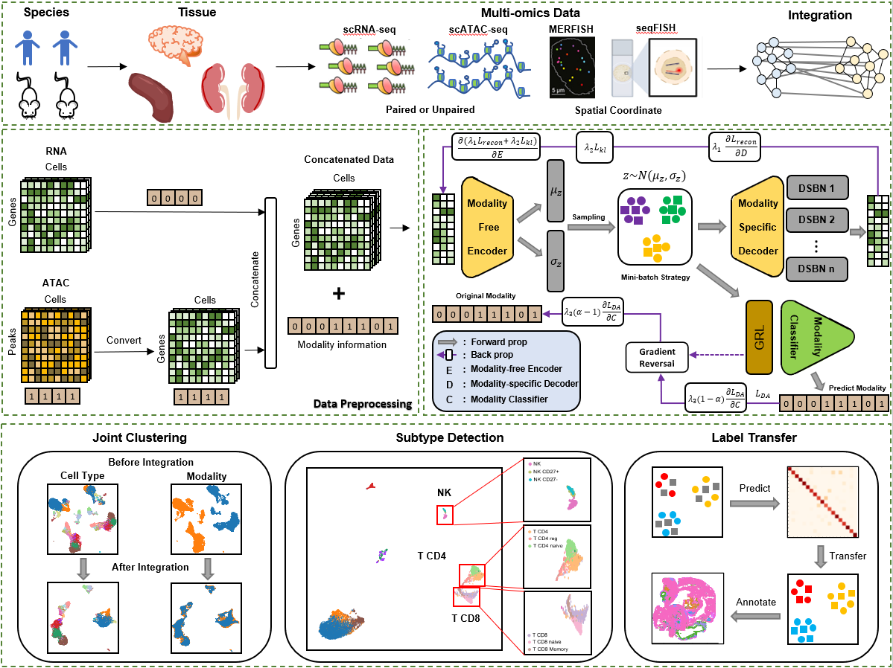

# scRabbit

***

Integrating data from various single-cell sequencing technologies provides deeper insights than analyzing individual assays alone. Although several methods have been developed to integrate single-cell multiomics data, they often focus heavily on the degree of mixing between different modalities, resulting in over-integration that can obscure distinctions among cell subtypes and biological conditions. To address this limitation, we introduce scRabbit, an unsupervised transfer learning-based framework for disentangling the over-integration of single-cell and spatial multiomics data. scRabbit maintains the integrity of distinct data sources by using domain-specific batch normalization to reconstruct original expression profiles while preserving unique modality-specific features, thereby reducing over-integration. Additionally, scRabbit utilizes a modality classifier to capture shared features across modalities, enhancing integration and improving model training efficiency. Comprehensive benchmarking analyses demonstrate that scRabbit outperforms current state-of-the-art methods across various complex scenarios, including paired and unpaired datasets, cell type imbalances, and different biological conditions. Furthermore, we evaluate the effectiveness of scRabbit in integrating single-cell RNA data with spatial omics data, such as MERFISH and seqFISH.

***



## Installation

***

To install scRabbit, please make sure you have PyTorch and scanpy installed. If you need more details on the dependencies, look at the requirements.txt file. Set up the environment for scRabbit:

```python
pip install -r requirements.txt
```

## Data

***

The example data is stored in the DATA folder, with a total of three datasets:

​	1.  PBMC3k: contains 2780 cells of RNA and 2780 cells of ATAC.

​	2.  SeuratData: contains 10412 cells of RNA and 10412 cells of ATAC.

​	3.  scRNA-seq and MERFISH: contains 30370 cells of RNA and 64373 cells of MERFISH.

## Examples

***

```python
import scRabbit
import scanpy as sc
import pandas as pd

freeze_support()

'''
	PBMC3k
'''

RNA = sc.read_h5ad('Data/PBMC3k/RNA.h5ad')
ATAC = sc.read_h5ad('Data/PBMC3k/ATAC.h5ad')

ATAC.obs['cell_type'] = ATAC.obs['cell_type'].astype('category')
ATAC.obs['batch'] = 1
ATAC.obs['batch'] = ATAC.obs['batch'].astype('category')
ATAC.obs['source'] = 'ATAC'

RNA.obs['cell_type'] = RNA.obs['cell_type'].astype('category')
RNA.obs['batch'] = 0
RNA.obs['batch'] = RNA.obs['batch'].astype('category')
RNA.obs['source'] = 'RNA'

adata = scRabbit(data_list=[RNA, ATAC],
                 outdir='result',
                 )

'''
	SeuratData
'''

RNA = sc.read_h5ad('Data/SeuratData/RNA.h5ad')
ATAC = sc.read_h5ad('Data/SeuratData/ATAC.h5ad')
labels = pd.read_csv('Data/SeuratData/meta.txt', sep='\t')
celltype = labels['cluster'].values

ATAC.obs['cell_type'] = celltype
ATAC.obs['cell_type'] = ATAC.obs['cell_type'].astype('category')
ATAC.obs['batch'] = 1
ATAC.obs['batch'] = ATAC.obs['batch'].astype('category')
ATAC.obs['source'] = 'ATAC'

RNA.obs['cell_type'] = celltype
RNA.obs['cell_type'] = RNA.obs['cell_type'].astype('category')
RNA.obs['batch'] = 0
RNA.obs['batch'] = RNA.obs['batch'].astype('category')
RNA.obs['source'] = 'RNA'

adata = scRabbit(data_list=[RNA, ATAC],
                outdir='result',
                )

'''
	scRNA-seq and MERFISH integration
'''

labels_merfish = pd.read_csv('Data/MERFISH/MERFISH_mouse1_cluster.txt', sep='\t')
celltype_merfish = labels_merfish['cluster_main'].values
labels_rna = pd.read_csv('Data/MERFISH/scRNA_cluster.txt', sep='\t')
celltype_rna = labels_rna['cluster_main'].values


adata_rna = sc.read_h5ad('Data/MERFISH/rna0.h5ad')
adata_merfish = sc.read_h5ad('Data/MERFISH/merfish0.h5ad')

print(adata_merfish)
print(adata_rna)

adata_merfish.obs['cell_type'] = celltype_merfish
adata_merfish.obs['domain_id'] = 0
adata_merfish.obs['domain_id'] = adata_merfish.obs['domain_id'].astype('category')
adata_merfish.obs['source'] = 'MERFISH'


adata_rna.obs['cell_type'] = celltype_rna
adata_rna.obs['domain_id'] = 1
adata_rna.obs['domain_id'] = adata_rna.obs['domain_id'].astype('category')
adata_rna.obs['source'] = 'RNA'

adata = scRabbit(data_list=[adata_rna, adata_merfish],
                outdir='result',
                modalities='rna_spatial',
                min_features=0,
                min_cells=0
                )


```

## Visualization and Evaluation

```python
import evaluation
import scanpy as sc
import pandas as pd
import original_embedding.py

'''
	Get original_embedding 
'''

original_embedding.get_original_embedding(RNA_file, ATAC_file, Meta_file)

'''
	Visualization
'''

# The embedding is stored in adata.obsm['embedding']
sc.pp.neighbors(adata, n_neighbors=30, use_rep='embedding')
sc.tl.umap(adata, min_dist=0.1)
sc.pl.umap(adata, color='source')
sc.pl.umap(adata, color='cell_type')

'''
	Evaluation
'''

Evaluation.evaluation_scRabbit(adata, ref='RNA', query='ATAC', rep='embedding')
# return ARI, NMI, F1, Batch Entropy and Silhouette score.
```


